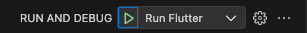
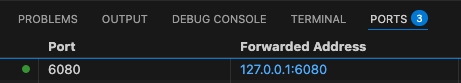
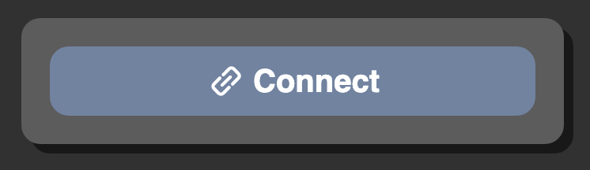
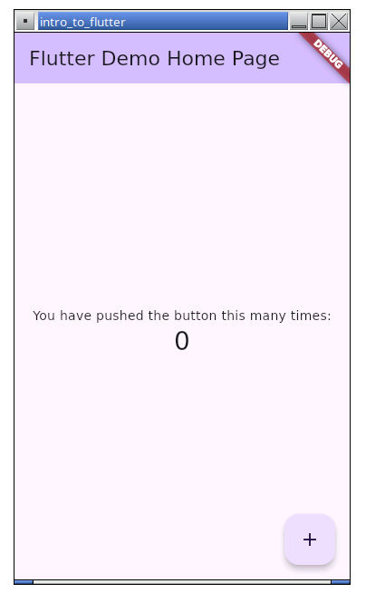
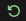

# Intro to Flutter Workshop
Try to keep this tab open in VSCode, to work through the content. If you lose this tab, you can re-open it at any time by opening the `WORKSHOP.md` file in the root directory.

You may like to dock this tab to the right by right-clicking the tab, and choosing **Split Right**.

## Getting Started
1. Wait until you can see the words `Linux (linux-x64)` in the **Bottom-Right Corner** (instead of `No Device`).
2. Open the **Run and Debug** Tab in VSCode 
3. Click the **Green Run Arrow** 
    - You may get a message saying the project has errors. Press **Run Anyway**
    - The build should only take about a minute the first time
    


4. Open the **Ports** Tab (you may need to open the bottom panel with this button in the top-right: )
5. Find the item in the list for `6080`



6. Right-click this item and choose **Open in Browser**.
7. In the browser tab that appears, click **Connect**.



Your app should be visible.



## Making Code Changes
1. Open the [`lib/1_flutter_sample/main.dart`](lib/1_flutter_sample/main.dart) file.
2. See if you can work out where the text on the main screen is and **change it**.
3. Save the file (*Ctrl+S*)
4. Notice that the change was **immediate** -- this is Flutter's amazing **Hot Reload** feature.
5. To change to a different sample, we can simply change the `import` statement on **line 5**:
```dart
import 'package:intro_to_flutter/2_widgets/main.dart';
```
6. Save the file.
7. This is a high-level change, and needs us to to **Hot Restart** by pressing the green restart button 

## Exploring Code Structure
Let's take a look at [`lib/main.dart`](lib/main.dart):
- The `main()` function is the entrypoint, calling `runApp()` and passing in a **Widget** caled `MyApp`.
- `MyApp` comes from the imported sample code in `lib/2_widgets`.

Now open [`lib/2_widgets/main.dart`](lib/2_widgets/main.dart). We have two simple classes in here, they're both `StatelessWidget`s:
- `MyApp` -- this creates a `MaterialApp` which is the root of the whole app, and uses Google's Material Styling. It sets the homepage of the app to `MyHomePage`. We could do routing and theming in here.
- `MyHomePage` -- this widget is the homepage, and uses a `Scaffold` to lay everything out.

The `body` of the `Scaffold` is where we put all the content of the page, basically like a `<body>` tag in HTML.

## Making Widgets
### `Text` Widget
The most basic widget, try changing your `body:` parameter to look like this: 